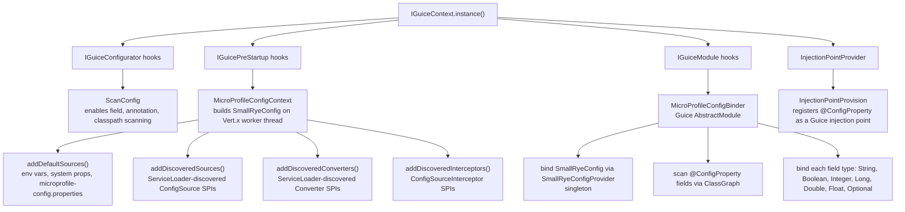
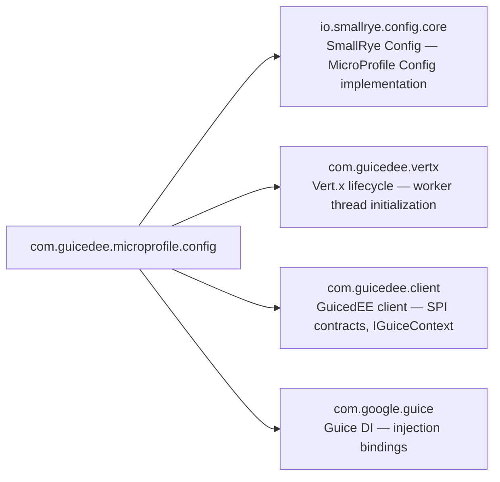

# GuicedEE MicroProfile Config

[](https://github.com/GuicedEE/Guiced-MicroProfileConfig/actions/workflows/build.yml)
[](https://central.sonatype.com/artifact/com.guicedee.microprofile/config)
[](https://github.com/GuicedEE/Packages/packages/maven/com.guicedee.microprofile.config)
[](https://www.apache.org/licenses/LICENSE-2.0)


MicroProfile Config implementation for [GuicedEE](https://github.com/GuicedEE) applications using **SmallRye Config** and **Google Guice**.
Inject configuration values with `@ConfigProperty`, resolve from environment variables, system properties, and `META-INF/microprofile-config.properties` — all wired automatically through SPI discovery and Guice bindings.

Built on [SmallRye Config](https://smallrye.io/smallrye-config/) · [MicroProfile Config](https://github.com/eclipse/microprofile-config) · [Google Guice](https://github.com/google/guice) · [Vert.x](https://vertx.io/) · JPMS module `com.guicedee.microprofile.config` · Java 25+

## 📦 Installation

```xml
<dependency>
  <groupId>com.guicedee.microprofile</groupId>
  <artifactId>config</artifactId>
</dependency>
```

<details>
<summary>Gradle (Kotlin DSL)</summary>

```kotlin
implementation("com.guicedee.microprofile:config:2.0.0-RC11")
```
</details>

## ✨ Features

- **CDI-style injection** — `@ConfigProperty(name = "key")` with automatic type conversion for `String`, `Boolean`, `Integer`, `Long`, `Double`, `Float`, and `Optional<T>` wrappers
- **Standards-compliant** — implements `org.eclipse.microprofile.config` APIs and annotations via SmallRye Config
- **Deterministic source ordering** — environment variables (highest), system properties, and classpath `META-INF/microprofile-config.properties` (lowest)
- **Custom converters** — register `Converter<T>` implementations via `ServiceLoader` for application-specific types
- **Profile support** — profile-specific properties (e.g. `%dev.key=value`) resolved by SmallRye Config
- **Guice-native** — `SmallRyeConfig` is bound as a singleton via `SmallRyeConfigProvider`; `@ConfigProperty` fields are scanned and bound at startup
- **Vert.x-aware initialization** — config is built on a Vert.x worker thread to avoid blocking the event loop
- **JPMS-ready** — named module with proper exports, provides, and opens directives

## 🚀 Quick Start

**Step 1** — Add a `microprofile-config.properties` file:

```properties
# src/main/resources/META-INF/microprofile-config.properties
messaging.enabled=true
messaging.bootstrap.servers=localhost:9092
liveness.port=8081
```

**Step 2** — Inject configuration values:

```java
import org.eclipse.microprofile.config.inject.ConfigProperty;

public class MessagingService {

    @ConfigProperty(name = "messaging.enabled", defaultValue = "true")
    boolean enabled;
    
    @ConfigProperty(name = "messaging.bootstrap.servers")
    String bootstrapServers;

    public void start() {
        if (enabled) {
            // use bootstrapServers
        }
    }
}
```

**Step 3** — Register via JPMS:

```java
module my.app {
    requires com.guicedee.microprofile.config;
}
```

The `MicroProfileConfigContext` initializes SmallRye Config automatically during `IGuicePreStartup`, and `MicroProfileConfigBinder` scans for all `@ConfigProperty` fields and binds them into Guice.

## 📐 Architecture



## ⚙️ Configuration Sources and Resolution

MicroProfile Config defines a composite of sources with numeric ordinals. Higher ordinal wins when keys overlap:

| Source | Ordinal | Example |
|---|---|---|
| Environment variables | 300 | `MESSAGING_ENABLED=true` |
| System properties | 200 | `-Dmessaging.enabled=true` |
| `META-INF/microprofile-config.properties` | 100 | `messaging.enabled=true` |

### Key mapping

Environment variable names follow MicroProfile Config rules:
- Dots (`.`) and hyphens (`-`) are replaced with underscores (`_`)
- Names are uppercased
- e.g. `messaging.bootstrap.servers` → `MESSAGING_BOOTSTRAP_SERVERS`

### Profiles

SmallRye Config supports profile-specific properties using the `%profile.` prefix:

```properties
# META-INF/microprofile-config.properties
db.url=jdbc:postgresql://prod-host:5432/mydb

# Profile-specific override
%dev.db.url=jdbc:postgresql://localhost:5432/mydb
```

Activate a profile with `mp.config.profile=dev` (system property or environment variable).

## 🔄 Programmatic Access

Inject the `SmallRyeConfig` instance directly for programmatic lookups:

```java
import jakarta.inject.Inject;
import io.smallrye.config.SmallRyeConfig;

public class HealthProbe {

    @Inject
    SmallRyeConfig config;

    public int livenessPort() {
        return config.getOptionalValue("liveness.port", Integer.class).orElse(8081);
    }
}
```

Or use the standard MicroProfile `Config` interface:

```java
import org.eclipse.microprofile.config.Config;
import org.eclipse.microprofile.config.ConfigProvider;

Config config = ConfigProvider.getConfig();
String value = config.getValue("messaging.enabled", String.class);
```

## 🔌 Supported Injection Types

`MicroProfileConfigBinder` scans all classes with `@ConfigProperty`-annotated fields and creates Guice bindings for each:

| Field type | Binding |
|---|---|
| `String` | Direct value from config |
| `boolean` / `Boolean` | Parsed via `Boolean.parseBoolean()` |
| `int` / `Integer` | Parsed via `Integer.parseInt()` |
| `long` / `Long` | Parsed via `Long.parseLong()` |
| `double` / `Double` | Parsed via `Double.parseDouble()` |
| `float` / `Float` | Parsed via `Float.parseFloat()` |
| `Optional<String>` | Wrapped optional |
| `Optional<Boolean>` | Wrapped optional |
| `Optional<Integer>` | Wrapped optional |
| `Optional<Long>` | Wrapped optional |
| `Optional<Double>` | Wrapped optional |
| `Optional<Float>` | Wrapped optional |

Default values are supported via `@ConfigProperty(defaultValue = "...")`.

## 🧩 Custom Converters

Register custom `Converter<T>` implementations via `ServiceLoader` for application-specific types:

```java
import org.eclipse.microprofile.config.spi.Converter;
import java.time.Duration;

public class DurationConverter implements Converter<Duration> {

    @Override
    public Duration convert(String value) {
        if (value.endsWith("ms")) return Duration.ofMillis(Long.parseLong(value.replace("ms", "")));
        if (value.endsWith("s")) return Duration.ofSeconds(Long.parseLong(value.replace("s", "")));
        throw new IllegalArgumentException("Unsupported duration format: " + value);
    }
}
```

Register via `META-INF/services/org.eclipse.microprofile.config.spi.Converter`:

```
com.example.DurationConverter
```

And then with JPMS:

```java
module my.app {
    provides org.eclipse.microprofile.config.spi.Converter
        with com.example.DurationConverter;
}
```

## 🔧 SPI Extension Points

All SPIs are discovered via `ServiceLoader`. Register implementations with JPMS `provides...with` or `META-INF/services`.

| SPI | Purpose |
|---|---|
| `IGuicePreStartup` | `MicroProfileConfigContext` — builds the `SmallRyeConfig` instance |
| `IGuiceModule` | `MicroProfileConfigBinder` — scans `@ConfigProperty` fields and binds to Guice |
| `IGuiceConfigurator` | `ScanConfig` — enables classpath, annotation, and field scanning |
| `InjectionPointProvider` | `InjectionPointProvision` — registers `@ConfigProperty` as an injection point |
| `ConfigSource` (MicroProfile) | Add custom config sources with custom ordinals |
| `Converter<T>` (MicroProfile) | Register custom type converters |
| `ConfigSourceInterceptor` (SmallRye) | Intercept and transform config values |

## 🗺️ Module Graph



## 🏗️ Key Classes

| Class | Package | Role |
|---|---|---|
| `MicroProfileConfigContext` | `config` | `IGuicePreStartup` — builds `SmallRyeConfig` on a Vert.x worker thread at startup |
| `MicroProfileConfigBinder` | `implementations` | `IGuiceModule` — scans `@ConfigProperty` fields and creates Guice bindings per type |
| `SmallRyeConfigProvider` | `implementations` | Guice `Provider<SmallRyeConfig>` — returns the shared config instance |
| `InjectionPointProvision` | `implementations` | `InjectionPointProvider` — registers `@ConfigProperty` for Guice injection point processing |
| `ScanConfig` | `implementations` | `IGuiceConfigurator` — enables classpath, annotation, and field scanning |

## 🧩 JPMS

Module name: **`com.guicedee.microprofile.config`**

The module:
- **exports** `com.guicedee.microprofile.config`
- **requires transitive** `io.smallrye.config.core`, `com.guicedee.vertx`
- **provides** `IGuicePreStartup` with `MicroProfileConfigContext`
- **provides** `IGuiceModule` with `MicroProfileConfigBinder`
- **provides** `InjectionPointProvider` with `InjectionPointProvision`
- **provides** `IGuiceConfigurator` with `ScanConfig`
- **opens** `com.guicedee.microprofile.config.implementations` to `com.google.guice`

In non-JPMS environments, `META-INF/services` discovery still works.

## 🧪 Testing

```java
import com.guicedee.client.IGuiceContext;
import com.google.inject.Injector;
import org.junit.jupiter.api.Test;
import static org.junit.jupiter.api.Assertions.*;

class ConfigTest {

    @Test
    void configPropertyFieldsAreInjected() {
        Injector injector = IGuiceContext.getContext().inject();
        MyConfigBean bean = injector.getInstance(MyConfigBean.class);
        assertNotNull(bean.getServerHost());
    }
}
```

Provide test configuration in `src/test/resources/META-INF/microprofile-config.properties`:

```properties
server.host=localhost
server.port=8080
```

## 🤝 Contributing

Issues and pull requests are welcome — please add tests for new type converters, config sources, or binding changes.

## 📄 License

[Apache 2.0](https://www.apache.org/licenses/LICENSE-2.0)
